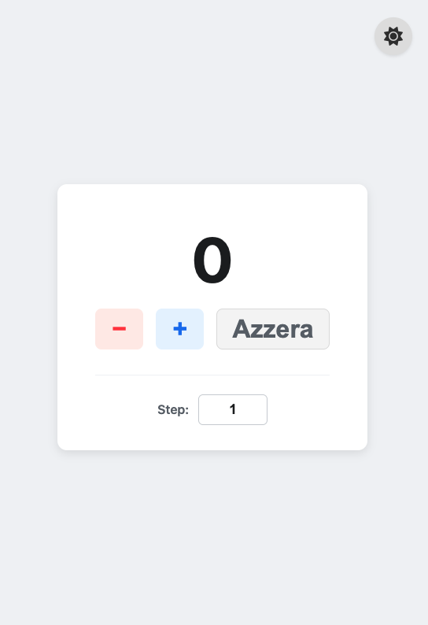
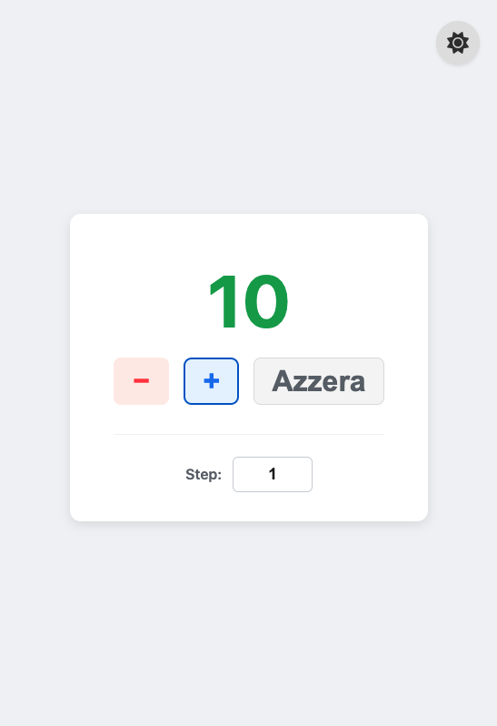
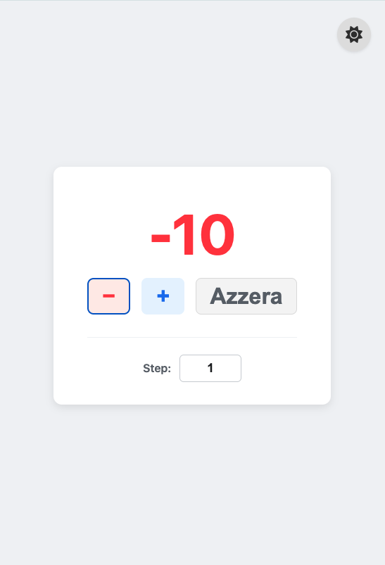
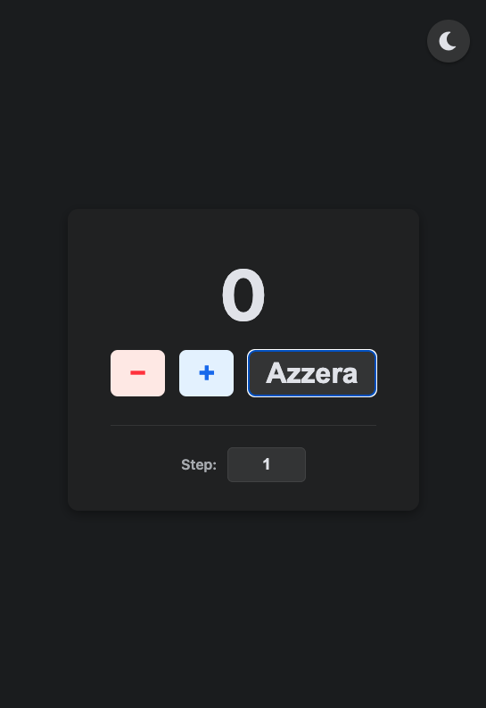
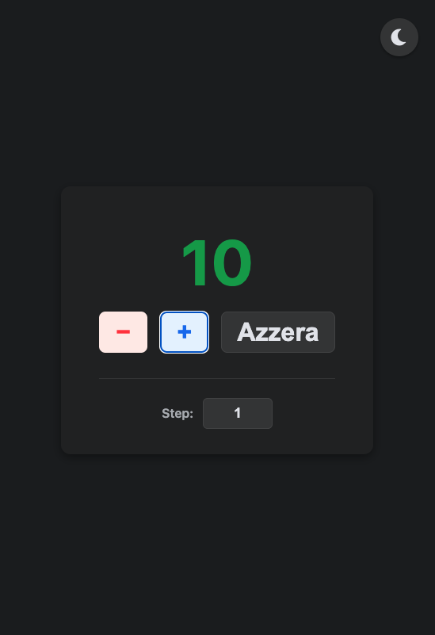
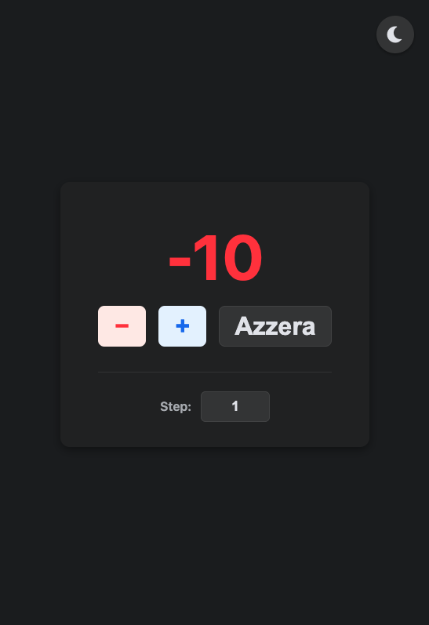
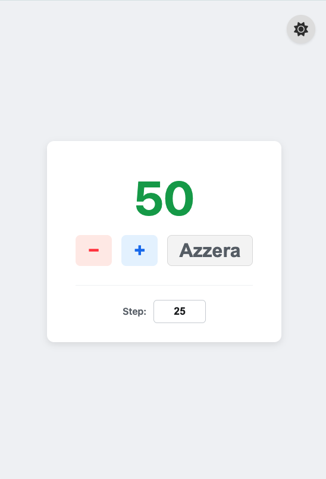
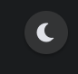
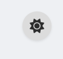

Contatore Avanzato con JavaScript

Descrizione del Progetto
Questo progetto è un'applicazione web interattiva che simula il comportamento di un contatore dinamico, sviluppata interamente con JavaScript puro, HTML5 e CSS3. È stata concepita per soddisfare i requisiti di una consegna per il Master, dimostrando una solida comprensione delle fondamenta dello sviluppo web front-end e l'implementazione di funzionalità avanzate.

L'applicazione offre un'esperienza utente ricca e personalizzabile, permettendo l'incremento e il decremento di un valore numerico tramite pulsanti e input da tastiera, con un "passo" configurabile. Particolare attenzione è stata dedicata alla reattività, all'accessibilità, alla persistenza dei dati e all'estetica, integrando un sistema di temi chiaro/scuro e feedback visivi/uditivi.

Funzionalità Implementate
Funzionalità Core (Requisiti Principali)
Incremento & Decremento: Pulsanti dedicati + e − per modificare il valore del contatore.

Valore Iniziale a Zero: Il contatore si inizializza a 0 al primo accesso o ripristina l'ultimo valore salvato.

Interfaccia Dinamica (Manipolazione DOM): Tutti gli elementi dell'interfaccia utente (display del valore, pulsanti, input per lo step, selettore tema) sono generati e gestiti dinamicamente tramite JavaScript puro, senza elementi UI predefiniti nell'HTML.

JavaScript Puro: L'intero progetto è sviluppato senza l'ausilio di librerie o framework JavaScript esterni (es. jQuery, React, Angular, Vue), in piena conformità con le specifiche del brief.

Funzionalità Avanzate Aggiuntive
Salvataggio Persistente (LocalStorage):

Il valore corrente del contatore e la preferenza del tema (chiaro o scuro) sono salvati automaticamente nel localStorage del browser.

Questo assicura che lo stato dell'applicazione sia mantenuto anche dopo aver chiuso e riaperto il browser o ricaricato la pagina.

Reset del Contatore:

Un pulsante "Azzera" permette di riportare istantaneamente il contatore a 0 e lo step di incremento/decremento a 1.

Step Personalizzabile:

Un campo di input numerico dedicato consente all'utente di definire un "passo" di incremento o decremento. Questo permette di modificare il valore del contatore di quantità maggiori di 1 (es. aumentare/diminuire di 5, 10, 20, etc.). Il valore minimo dello step è 1.

Controlli da Tastiera:

L'applicazione risponde a input specifici da tastiera per un'interazione più rapida ed efficiente:

+ o ↑ (Freccia Su): Incrementa il contatore.

- o ↓ (Freccia Giù): Decrementa il contatore.

R (maiuscolo o minuscolo): Resetta il contatore.

Feedback Sonoro:

Ogni interazione utente (incremento, decremento, reset) è accompagnata da un breve "beep" distintivo, fornendo un feedback uditivo immediato e migliorando l'esperienza interattiva.

Tema Chiaro/Scuro Dinamico:

Un pulsante circolare posizionato in alto a destra dello schermo, fuori dal riquadro principale del contatore, permette di alternare tra un tema visivo chiaro e uno scuro.

L'icona sul pulsante cambia dinamicamente: mostra un'icona di sole ☀️ in modalità chiara e di luna 🌙 in modalità scura, rendendo la funzione intuitiva.

La preferenza del tema viene salvata nel localStorage per persistere tra le sessioni.

Colori Dinamici del Valore:

Il display del contatore cambia colore in base al suo valore:

Verde (#31a24c) per i numeri positivi.

Rosso (#fa383e) per i numeri negativi.

Questi colori sono garantiti per essere visualizzati correttamente e distintamente in entrambe le modalità (chiara e scura), assicurando un'esperienza utente consistente e chiara.

⚙️ Tecnologie Utilizzate
HTML5: Per la struttura semantica e l'organizzazione della pagina web.

CSS3: Per la stilizzazione, il layout responsivo e la definizione dei temi chiaro/scuro e dei colori dinamici.

JavaScript (ES6+): Il motore dell'applicazione, responsabile della logica del contatore, della manipolazione del DOM, della gestione degli eventi e di tutte le funzionalità aggiuntive.

Web Storage API (LocalStorage): Utilizzato per la persistenza del valore del contatore e della preferenza del tema tra le sessioni del browser.

Web Audio API: Impiegato per la generazione di brevi feedback sonori "beep" in risposta alle interazioni dell'utente.

Font Awesome 6: Libreria di icone esterna, inclusa via CDN, utilizzata per fornire le icone SVG del sole e della luna per il selettore del tema.

📂 Struttura del Progetto
Il progetto è organizzato in una struttura di directory chiara e modulare, seguendo le migliori pratiche per la manutenibilità e la scalabilità del codice:

.
├── index.html        # Pagina principale dell'applicazione.
├── README.md         # Questo file, contenente la descrizione del progetto.
├── css/              # Cartella dedicata ai fogli di stile.
│   └── style.css     # Stili CSS globali e specifici del contatore, inclusi i temi.
├── js/               # Cartella dedicata agli script JavaScript.
│   └── script.js     # Tutta la logica dell'applicazione (manipolazione DOM, eventi, stato).
└── screenshots/      # Cartella dedicata agli screenshot dell'applicazione.

📸 Screenshot dell'Applicazione

Modalità Chiara:

* 
* 
* 

Modalità Scura:

* 
* 
* 

Funzionalità Aggiuntive in Azione:

* 
* 
* 

🌐 Live Demo & Repository
Puoi esplorare il codice sorgente completo di questo progetto e provare l'applicazione interattiva direttamente online ai seguenti link:

Live Demo: https://progetto-javascript-di-erika-rossi.netlify.app/

Repository GitHub: https://github.com/erikarossi95/Progetto-JavaScript-di-Erika-Rossi

🧑‍💻 Autore
Erika Rossi

📜 Licenza
Questo progetto è rilasciato sotto licenza MIT. 
